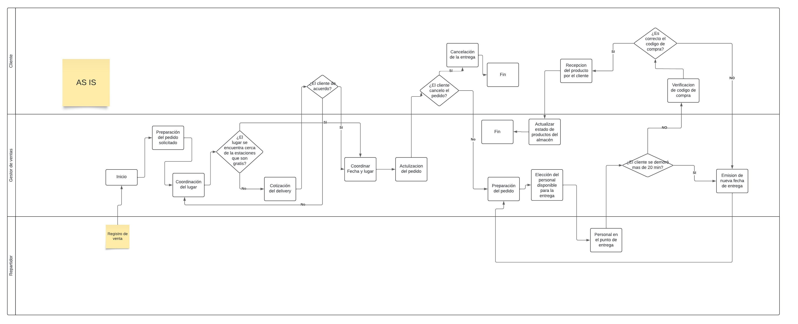
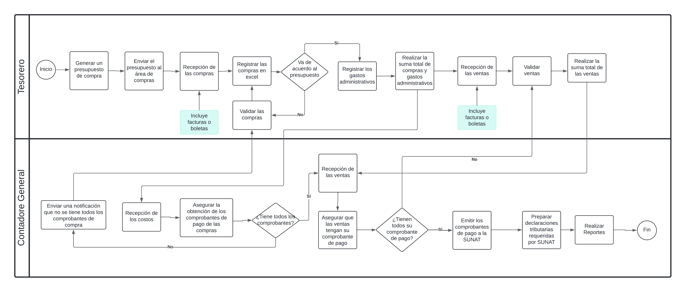
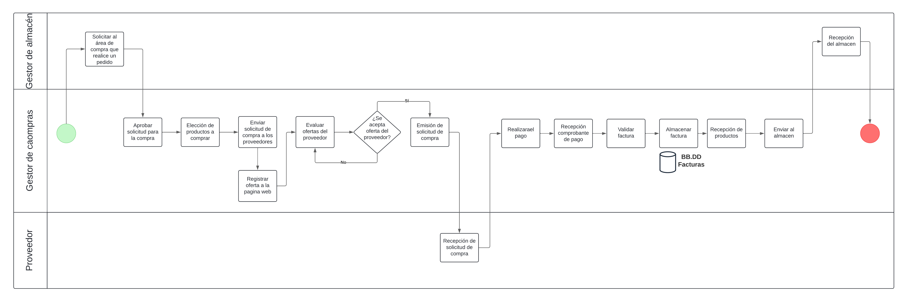
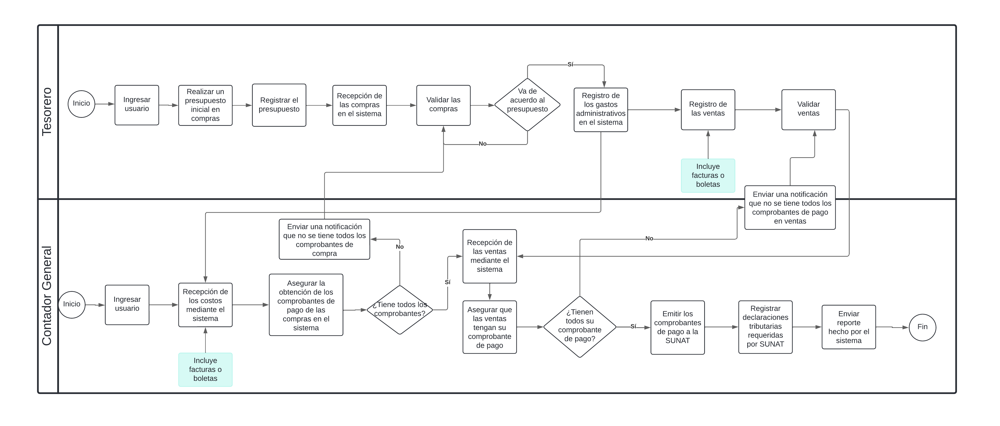

## 1. Descripción de la Empresa, del Proceso de Negocio Elegido y Motivación
### 1.1 Datos de la empresa
- Descripción de la empresa: Es una microempresa que vende maquillaje y papelería que busca traer productos de buena calidad y buen precio, sus principales productos son maquillaje, lapiceros, cuadernos.

- RUC:
- Razón social:
- Dirección:
- Teléfono:
- Misión: Nuestra misión es ser un referente en el mercado por la diversidad y calidad de nuestros productos en papelería y maquillaje. Buscamos ofrecer una orientación personalizada a nuestros clientes para encontrar los productos que mejor se adapten a sus gustos con la única finalidad de satisfacerlos.💗✨
- Visión: Nuestra visión es ser reconocidos como el espacio preferido para aquellos que buscan una experiencia de compra excepcional en el mundo del maquillaje y la papelería por lo que nos esforzamos por crear un ambiente acogedor y emocionante, donde los clientes puedan explorar una amplia diversidad de productos y recibir asesoramiento personalizado por parte de nuestro equipo capacitado. Es así que aspiramos establecer relaciones sólidas y duraderas con nuestros clientes, basadas en la confianza, la satisfacción y la lealtad hacia nuestro servicio por eso es que nos innovaremos constantemente para mantenernos a la vanguardia de las tendencias y necesidades de nuestros público, sin descuidar la dedicación y calidad procurada. 💗
- Productos ofrecidos:
  - Papelería:
    - Cuadernos
    - Lapiceros
  - Maquillaje
    - Paletas
    - Rubores
    - Primers
    - Polvos y correctores
    - Glitter
    - Delineadores de ojos y labios
    - Labiales y glosses
    - Máscaras de pestañas
### 1.2 Descripción del proceso de negocio

- Proceso de compra - Este proceso se refiere a las compras de los diversos productos para el almacén de la empresa y poder venderlos.
- Proceso de venta - Este proceso es acerca de los procesos de venta en la empresa que inicia desde que el cliente nos contacta para venderle el producto.
- Proceso de almacen - Este proceso se refiere a cómo se gestiona el almacén de manera que constatemente se verifica el stock de los productos.
- Proceso de distribucion - Este proceso se refiere a las actividades que abarcan llevar el producto hasta el cliente.
- Proceso de marketing - Este proceso es acerca de las actividades que realizan para llamar al cliente.
- Proceso de finanzas - Este proceso abarca las diversas actividades en que se gestionan las ganancias y perdidas en base a las compras, los gastos y las ventas.
- Proceso de CRM - Este proceso abarca las actividades para mapear a los clientes y saber mejor sus necesidades.

### PROCESO AS IS

- Proceso de Compra

|Secuencia | Actividad | Descripción | Responsable |
|:----:|:----------------:|:--------------------------:|:-----------:|
| 1 | Solicitud del área de almacén para realizar una compra | El área de almacén solicitó realizar una compra porque ya no quedan existencias de algún producto. | Gestor de almacén |
| 2 | Aprobación para solicitar una compra | El área de compra recibe la solicitud de falta de productos y procede a aprobarla | Gestor de compras |
| 3 | Elección de productos a comprar | El área de compra revisa los productos faltantes emitidos en la solicitud y procede a revisar la cantidad que comprara de dichos productos | Gestor de compras |
| 4 | Evaluación del proveedor | El área de compra revisa todas las ofertas realizadas por los proveedores y decide aceptarlas o rechazarlas en función al precio que ofrezcan | Gestor de compras |
| 5 | Emisión de solicitud de compra | El área de compra se acepta una propuesta del proveedor y procede a emitir una solicitud de compra hacia dicho proveedor | Gestor de compras |
| 6 | Recepción de la solicitud por parte del proveedor| El proveedor recepciona la solicitud emitida por el área de compras. | Proveedor |
| 7 | Realización del pago | El área de compra realiza el pago acordado hacia el proveedor | Gestor de compras |
| 8 | Recepción del comprobante de pago del Proveedor | El área de compras recepciona el comprobante de pago que realizo hacia el proveedor | Gestor de compras |
| 9 | Validación de la Factura | Se valida la factura emitida hacia la empresa| Contador |
| 10 | Almacenar Documento | Se almacena la factura que fue emitida | Contador | 
| 11 | Registrar la compra en Excel | Se registran los productos comprados en un Excel | Gestor de Compra |
| 12 | Recepción de productos | La empresa recepciona los productos que fueron entregados | Gestor de compra |
| 13 | Envió al almacén | Se envía al almacén todos los productos recepcionados para su posterior revisión | Gestor de compra |
| 14 | Recepción en almacén | En el almacén recepciona todos los productos y serán revisados para asegurarse que llegaron en correcto estado | Gestor de almacén |

- Proceso de Venta

- Proceso de Almacén

- Proceso de Distribución
  

- Proceso de Marketing

- Proceso de CRM

- Proceso de Finanzas

### PROCESO TO BE

- Proceso de Compra

|Secuencia | Actividad | Descripción | Responsable |
|:----:|:----------------:|:--------------------------:|:-----------:|
| 1 | Solicitud del área de almacén para realizar una compra | El área de almacén solicitó realizar una compra porque ya no quedan existencias de algún producto. | Gestor de almacén |
| 2 | Aprobar solicitud para la compra | El área de compra recibe la solicitud del área del almacén y luego de revisarlo se acepta | Gestor de compras |
| 3 | Elección de productos a comprar | El área de compra revisa los productos faltantes emitidos en la solicitud y procede a revisar la cantidad que comprara de dichos productos | Gestor de compras |
| 4 | Enviar solicitud de compra a los proveedores | El área de compra envía solicitudes a los proveedores de los productos que les hacen falta | Gestor de compras |
| 5 | Registrar oferta en la web | El gestor de compras registra su oferta en la web para posteriormente poder visualizarlo en la pestaña de historial | Gestor de compras|
| 6 | Evaluar ofertas del proveedor | El área de compra revisa todas las ofertas realizadas por los proveedores y decide aceptarlas o rechazarlas | Gestor de compras |
| 7 | Emisión de solicitud de compra | El área de compras envía una solicitud de compra al proveedor que fue aceptado su oferta | Gestor de compras |
| 8 | Recepción de la solicitud por parte del proveedor| El proveedor recepciona la solicitud emitida por el área de compras. | Proveedor |
| 9 | Realización del pago | El área de compra realiza el pago acordado hacia el proveedor | Gestor de compras |
| 10 | Recepción del comprobante de pago del Proveedor | El área de compras recepciona el comprobante de pago que realizo hacia el proveedor | Gestor de compras |
| 11 | Validación de la Factura | Se valida la factura emitida hacia la empresa| Gestor de compras |
| 12 | Almacenar Factura | Se almacena la factura en una base de datos que luego revisara el contador | Gestor de compras | 
| 13 | Recepción de productos | La empresa recepciona los productos que fueron entregados | Gestor de compra |
| 14 | Enviar al almacén | Se envía al almacén todos los productos recepcionados para su posterior revisión | Gestor de compra |
| 15 | Recepción en almacén | En el almacén recepciona todos los productos y serán revisados para asegurarse que llegaron en correcto estado | Gestor de almacén |

- Proceso de Venta

- Proceso de Almacén

- Proceso de Distribución
  

- Proceso de Marketing

- Proceso de Finanzas

- Proceso de CRM

### 1.3 Motivación
-
## 2. Módulos
### 2.1 Módulo Compra-Proveedores
- Responsabilidades: Gestionar el proceso de compra, elección de proveedores, añadir nuevos proveedores, subir los archivos de la cotizacion que el proveedor le ofrece y confirmar o rechazar las ofertas del proveedor.

- Interacción: Con el módulo de almacen y finanzas.

- Funcionalidad:

  **- Home Gestor Compra**
    - Responsabilidades: Permite al gestor de compras tener su propia vista de las partes que constituyen su módulo, como son la visualizacion de proveedores, acceso al stock y acceso a finanzas.

  **- Proveedores Actuales**
    - Responsabilidades: Permite al gestor visualizar y acceder al historial de todos los proveedores con las que la empresa esta trabajando.

  **- Añadir proveedores**
    - Responsabilidades: Permite al gestor de compras añadir nuevos proveedores con los que va a trabajar.

  **- Perfil del proveedor**
    - Responsabilidades: Permite al gestor de compras visualizar, gestionar y actualizar la información de los proveedores con los que está trabajando.

  **- Historial del proveedor**
    - Responsabilidades: Muestra al gestor de compras un registro detallado de las ofertas no aceptadas, aceptadas y pendientes por aceptar/rechazar, dentro de la plataforma a lo largo del tiempo. Además permite que el gestor pueda realizar un seguimiento de sus ofertas pasadas.

  **- Datos de cotización**
    - Responsabilidades: Permite visualizar el detalle de la cotización de productos que ha realizado el proveedor a la empresa.

  **- Confirmar Oferta**
    - Responsabilidades: Permite al gestor de compras aceptar o rechazar la oferta final que ha realizado el proveedor hacia la empresa.

### 2.2 Módulo Venta
### 2.3 Módulo Almacén
### 2.4 Módulo Distribución
### 2.5 Módulo Marketing
### 2.6 Módulo Finanzas
### 2.7 Módulo CRM

## 3. Requerimientos
### 3.1 Requerimientos Funcionales

**Caso de uso N°: Añadir proveedor**

| Objetivo | 
Permitir que el Gestor de compras pueda añadir proveedores a la página de Migni Store.
 | 
|:--------------:|--------------|
| Descripción | Proceso de registro de proveedores en la aplicación, con datos de empresa ya sea nombre, dirección, numero, rubro, correo y sitio web.  | 
| Actor primario   | Gestor de compras | 
|Actor secundario| - |
|Precondiciones | El proveedor ya debe haber contactado con la empresa previamente |
| Paso | 
 Acción 
 |
| 1 | El gestor de compras accede a la pagina web |
| 2 | El gestor de compras ingresa sus datos de inicio de sesión |
| 3 | El gestor de compras se dirige al apartado de proveedores |
| 4 | El gestor de compras se dirige a “añadir proveedores”|
| 5 | El gestor de compras registra el nombre, teléfono, dirección, correo electrónico, rubro, sitio web y foto del proveedor |
| 6 | El sistema guarda los datos del proveedor |
| 7 | El sistema confirma de la creación de un nuevo proveedor |
| 8 | El caso termina |

**Caso de uso N°: Añadir proveedor**

| Objetivo | 
 Permitir que el gestor de compras pueda aceptar o rechazar la oferta realizada por el proveedor d
 | 
|:--------------:|--------------|
| Descripción | Proceso en el cual se puede visualizar la oferta, con estado pendiente y aceptar o rechazar dicha oferta| 
| Actor primario   | Gestor de compras | 
|Actor secundario| - |
|Precondiciones | El proveedor debe haber sido registrado por el gestor de compras |
| Paso | 
 Acción 
 |
| 1  | El gestor de compras ingresa a la plataforma web con su correo y contraseña|
| 2  | El gestor de compras se dirige a la sección de proveedores |
| 3  | El gestor de compras selecciona el proveedor que desee verificar su historial |
| 4  | El gestor de compras accede a la parte de registros del proveedor elegido |
| 5  | El gestor de compras revisa las solicitudes pendientes |
| 6  | El gestor de compras ingresa a la solicitud pendiente|
| 7  | El gestor de compras acepta o rechaza la oferta del proveedor |
| 8  | Se actualiza el estado de la oferta  |
| 9 | El caso se termina |

**Caso de uso N°: Visualizar proveedores/historial**

| Objetivo | 
  Permitir a los gestores poder acceder  y visualizar los proveedores y registros, con sus datos. 
 | 
|:--------------:|--------------|
| Descripción | Proceso mediante el cual los administradores pueden acceder a las finanzas y datos relevantes para evaluar la utlización de los recursos. | 
| Actor primario | Gestor de compras | 
|Actor secundario| - |
|Precondiciones | El proveedor debe haber sido registrado por el gestor de compras |
| Paso | 
 Acción 
 |
| 1 | El gestor de compras ingresa a la plataforma web con su correo y contraseña. |
| 2 | El gestor de compras ingresa a la sección de Proveedores |
| 3 | El sistema muestra la sección de Proveedores que fueron registrados|
| 4 | El gestor de compras elige de que proveedor va a revisar la información |
| 5 | El gestor de compras selecciona la opción de registros |
| 6 | El sistema muestra el historial de ofertas que fueron subidas a la pagina web y su estado|
| 7 | El caso termina |

## 4. Prototipo
- Para ver el prototipo debe ingresar al siguiente enlace:

[Figma](https://www.figma.com/file/JaEtbwPTFhxpp8rVLio8Lc/Proyecto-Migni-Store?type=design&node-id=56-105&mode=design&t=6vRNAXtGiQCHDJhl-0)

## 5. Modelado Conceptual
### 5.1 Diagrama de entidad relación
- Modelo Conceptual

## 6. Modelado Relacional
### 6.1 Modelo Lógico

[Modelo Lógico](https://drive.google.com/file/d/1_JcvnJOoGrkaA1rP-jQhsR2sMmhgNscB/view?usp=sharing)

